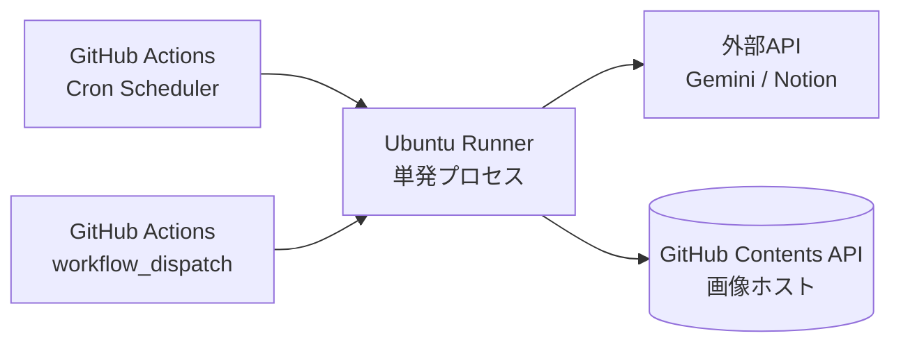

# 技術仕様書 (Architecture Design Document)

本書は `docs/product-requirements.md` および `docs/functional-design.md` を実装するための技術選定・アーキテクチャを定義する。

---

## 全体アーキテクチャ概要

本システムは **GitHub Actions 上で週次実行される純粋なバッチ処理** である。サーバーレス・ステートレス構成を採用し、状態管理は外部SaaS（Notion）に完全に委譲する。

### 実行モデル



**重要な設計判断**:
- **状態を持たない**: ローカルDB・ローカルファイルは使わない。記事の重複判定は実行時にNotionへ都度クエリする
- **外部ホスト依存を最小化**: 画像ホストもGitHub上に置き、外部サービス契約を発生させない
- **単一プロセス・短時間実行**: 15分以内の完結を前提に、監視・HA・デプロイ自動化は不要

---

## テクノロジースタック

### 言語・ランタイム

| 技術 | バージョン | 選定理由 |
|------|-----------|----------|
| Node.js | v24.11.0 | devcontainer 指定版。ESM ネイティブ対応、`fetch`・`AbortController` 等の標準化されたAPIで外部依存を減らせる |
| TypeScript | 5.x | strict モードで型安全性を担保。Gemini / Notion SDK の型定義が充実 |
| npm | 11.x | Node.js 24 に標準搭載。`package-lock.json` による依存の厳密管理 |

### 主要ライブラリ

| ライブラリ | バージョン | 用途 | 選定理由 |
|-----------|-----------|------|----------|
| @google/genai | ^0.x（最新版） | Gemini 2.5 Pro / 2.5 Flash Image 呼び出し | 公式SDK。テキスト生成と画像生成を単一SDKで扱え、認証を一本化できる |
| @notionhq/client | ^2.x | Notion API ラッパー | 公式SDK。TypeScript 型定義が組み込み |
| @octokit/rest | ^21.x | GitHub Contents API（画像アップロード） | 公式クライアント。認証・リトライが組み込み |
| rss-parser | ^3.x | RSS/Atom 取得・パース | 小さく枯れた実装、RSS/Atom 両対応 |
| commander | ^14.x | CLI 引数パース | プロジェクト既存依存、軽量 |
| pino | ^9.x | 構造化ロギング | GitHub Actions ログに1行JSONで出力しやすい |
| zod | ^3.x | 環境変数・設定ファイルの検証 | Gemini 構造化出力のスキーマ検証にも流用可能 |

### 開発ツール

| 技術 | バージョン | 用途 | 選定理由 |
|------|-----------|------|----------|
| Vitest | ^2.x | テストランナー | ESM/TSネイティブ対応、既存プロジェクト設定済み |
| ESLint | ^9.x (flat config) | 静的解析 | 既存プロジェクト設定済み |
| Prettier | ^3.x | フォーマッタ | 既存プロジェクト設定済み |
| typescript-eslint | ^8.x | TS 用 Lint ルール | `eslint` と連携し型を活用したチェック |
| husky + lint-staged | ^9.x / ^15.x | pre-commit フック | 既存プロジェクト設定済み |
| @vitest/coverage-v8 | ^2.x | カバレッジ計測 | V8 ネイティブカバレッジで高速 |

---

## レイヤードアーキテクチャ

### レイヤー構成

```
┌──────────────────────────────────────────────┐
│  CLI レイヤー                                 │
│  src/cli/                                     │
│  責務: 引数・環境変数の解釈、エントリーポイント  │
├──────────────────────────────────────────────┤
│  Orchestrator レイヤー                        │
│  src/orchestrator/                            │
│  責務: 処理フロー制御、エラー伝搬方針、集計     │
├──────────────────────────────────────────────┤
│  Service レイヤー                             │
│  src/services/                                │
│  責務: ドメインロジック（収集・LLM・投稿）      │
├──────────────────────────────────────────────┤
│  Infra レイヤー                               │
│  src/infra/                                   │
│  責務: 外部API呼び出しラッパー（タイムアウト等） │
└──────────────────────────────────────────────┘
```

### 依存方向のルール

```
CLI → Orchestrator → Service → Infra    (OK)
Service → Service                        (NG: 横連携禁止)
Infra → Service                          (NG: 逆流禁止)
```

**実装上の強制方法**:
- ディレクトリ単位でモジュールを分離
- ESLint の `import/no-restricted-paths` で依存違反を検知（将来導入）
- 各レイヤーのエクスポートは `index.ts` に集約し、内部実装を隠蔽

### 各レイヤーの許可される依存

| レイヤー | 依存してよい先 | 具体的な主な依存 |
|---------|--------------|----------------|
| CLI | Orchestrator, Config, Domain | commander |
| Orchestrator | Service, Domain, utils | pino |
| Service | Infra, Domain, utils | pino |
| Infra | 外部SDK, Domain | @google/genai, @notionhq/client, rss-parser, @octokit/rest |

`domain/types.ts` は全レイヤーから参照可能（型のみで実装を含まないため）。

---

## データ永続化戦略

本システムは **ローカル状態を一切持たない**。全ての永続データは外部SaaSに保存する。

### ストレージ方式

| データ種別 | ストレージ | フォーマット | 選定理由 |
|-----------|----------|-------------|----------|
| 再構成された記事 | Notion Database | Notion Page（ブロック構造） | ユーザーのナレッジベースとして直接利用するため、最終出力先 = 永続層とする |
| 生成画像 | GitHub リポジトリ（`generated-images` ブランチ） | PNG (`image/png`) | 外部ホスト依存を避ける。`raw.githubusercontent.com` 経由でNotionから参照可能 |
| 重複判定キー | Notion Database（`URL` プロパティ） | 文字列 | 投稿先と判定対象を同一にすることで整合性問題を排除 |
| 実行ログ | GitHub Actions ログ | 構造化JSON（pino） | ワークフロー実行履歴として自動保存、別途ストレージ不要 |
| 実行パラメータ設定 | `config/sources.json`（Git管理） | JSON | コードと一緒にレビュー可能、環境差を排除 |

### 画像ホスト方式の詳細

#### 採用方式: GitHub Contents API + 専用ブランチ

```
リポジトリ: tmynkgw/poc-genai-trend-sync
ブランチ  : generated-images （孤立ブランチ、main とは無関係）
パス     : YYYY/MM/{articleId}.png
URL     : https://raw.githubusercontent.com/tmynkgw/poc-genai-trend-sync/generated-images/YYYY/MM/{articleId}.png
```

**手順**:
1. `@octokit/rest` の `repos.createOrUpdateFileContents` でbase64エンコードした画像を `generated-images` ブランチに直接アップロード
2. レスポンスのコミットSHAから `raw.githubusercontent.com` URL を組み立て
3. Notion API の `image` ブロックに外部URLとして埋め込む

**メリット**:
- 外部サービス契約不要（Imgur / S3 等）
- `GITHUB_TOKEN` のみで認証完結
- main ブランチの履歴を汚染しない（孤立ブランチ使用）

**デメリット／制約**:
- **リポジトリが Private だと raw URL は認証が必要** → 本PoCでは Public リポジトリを前提とする
- 長期運用で `generated-images` ブランチが肥大化 → 6ヶ月以上古い画像を定期削除するクリーンアップワークフローを将来追加（Post-MVP）

**代替案検討**:
- **Imgur / ImgBB**: API有り、無料枠有り。但し利用規約・プライバシー観点で社内情報の掲載は避けたい → 採用せず
- **Cloudflare R2 / S3**: 確実で拡張性も高い。但しPoC段階で契約・認証設定のコストが見合わない → Post-MVP で検討

### バックアップ戦略

本システムは状態を持たないため、システム自体のバックアップは不要。以下は関連データの扱い:

| 対象 | 方針 |
|------|------|
| Notion ページ | Notion のネイティブバックアップ機能に依存 |
| 生成画像 | GitHub リポジトリの通常の Git 履歴に依存 |
| コード・設定 | GitHub リポジトリの通常の Git 履歴に依存 |
| APIキー | GitHub Secrets の暗号化ストレージに依存 |

---

## 実行・デプロイ戦略

### GitHub Actions ワークフロー

本システムの「デプロイ」は main ブランチへの push そのもの。ワークフローは実行時に最新のコードを参照する。

#### weekly-sync.yml（本番定期実行）

```yaml
on:
  schedule:
    - cron: '0 0 * * 1'  # JST 月曜 9:00 = UTC 月曜 0:00
  workflow_dispatch:
    inputs:
      max_articles: { required: false, default: '5' }
      lookback_days: { required: false, default: '7' }
      test_mode: { type: boolean, default: false }

permissions:
  contents: write  # generated-images ブランチへの push に必要
```

**必要な Secrets**:
- `GEMINI_API_KEY`
- `NOTION_API_KEY`
- `NOTION_PARENT_PAGE_ID`（必須。"AI Trend Sync DB" を自動生成・再利用する親ページ ID）
- `NOTION_PARENT_PAGE_ID_TEST`（テストモード時にオプション。未設定時は `NOTION_PARENT_PAGE_ID` を使用）

**ワークフローの基本ステップ**:
1. `actions/checkout@v4`
2. `actions/setup-node@v4` (Node.js 24)
3. `npm ci`
4. `npm run build`
5. `node dist/cli/index.js [引数]`

### 実行環境

| 項目 | 値 | 備考 |
|------|-----|------|
| ランナー | `ubuntu-latest` | GitHub Actions 標準 |
| Node.js | 24.x | `.nvmrc` またはワークフローで固定 |
| タイムアウト | 20分 | 非機能要件15分 + バッファ |
| 並列度 | 1 | 重複投稿回避のため同時実行は1本に制限 |
| 同時実行制御 | `concurrency: genai-trend-sync` | `cancel-in-progress: false` |

---

## パフォーマンス要件

### 実行時間目標

| 処理 | 目標時間 | 測定方法 |
|------|---------|---------|
| 全体実行（3ソース × 5記事 = 15件想定） | 15分以内 | GitHub Actions の `Run time` で確認 |
| RSS取得（1ソース） | 5秒以内 | pinoログの `durationMs` フィールド |
| LLM 再構成（1記事） | 30秒以内 | `AbortSignal.timeout(30000)` で強制 |
| 画像生成（1記事） | 60秒以内 | `AbortSignal.timeout(60000)` で強制 |
| Notion 投稿（1記事） | 10秒以内 | pinoログの `durationMs` フィールド |

### リソース使用量

GitHub Actions `ubuntu-latest`（2core, 7GB RAM, 14GB SSD）を前提。

| リソース | 想定使用量 | 上限 |
|---------|-----------|------|
| メモリ | 500MB 程度（画像バッファを含む） | ランナー上限 7GB で余裕 |
| ディスク | 50MB 程度（node_modules + 一時画像） | ランナー上限 14GB で余裕 |
| 外部API呼び出し（週次1回） | Gemini: 30回、Notion: 20回、GitHub: 15回 | 各サービスの無料/Standard枠内 |

### スループット設計

- **RSS取得**: `Promise.all` で並列実行（3〜10ソース同時）
- **LLM / 画像生成**: 直列実行（レート制限回避）
- **Notion投稿**: 直列実行（冪等性担保とレート制限回避）

---

## セキュリティアーキテクチャ

### 機密情報の管理

| 機密情報 | 保管場所 | コードでの取得方法 |
|---------|---------|-------------------|
| `GEMINI_API_KEY` | GitHub Secrets | `process.env.GEMINI_API_KEY`（zodで必須検証） |
| `NOTION_API_KEY` | GitHub Secrets | 同上 |
| `NOTION_PARENT_PAGE_ID` | GitHub Secrets | 必須。"AI Trend Sync DB" を自動生成・再利用する親ページ ID |
| `NOTION_PARENT_PAGE_ID_TEST` | GitHub Secrets | テストモード時にオプション。未設定時は `NOTION_PARENT_PAGE_ID` を使用 |
| `GITHUB_TOKEN` | Actions 自動注入 | 画像アップロード用、`contents: write` 権限のみ付与 |

**ルール**:
- ソースコード・設定ファイル・コミットメッセージに機密情報を含めない
- pino の `redact` オプションで APIキー形式を検出した場合は `[REDACTED]` に置換
- `.env` ファイルの誤コミット防止のため `.gitignore` に追加（開発者ローカル用）

### 入力検証

| 入力ソース | 検証方法 |
|-----------|---------|
| CLI引数 | commander のバリデーション + zod |
| 環境変数 | zod スキーマ（必須項目・型・形式） |
| `config/sources.json` | zod スキーマ |
| RSS レスポンス | rss-parser に委譲 + 追加で URL 形式検証 |
| Gemini レスポンス | Structured Output（responseSchema）+ zod での2重検証 |

### 外部公開範囲

| 公開対象 | 公開範囲 | 判断理由 |
|---------|---------|---------|
| リポジトリコード | Public | 画像の raw URL 利用のため。機密情報は Secrets のみ |
| 生成画像 | Public（raw URL） | リンクを知る者のみアクセス可だが、機密を画像に含めない方針 |
| Notion データベース | 個人ワークスペース + 社内共有 | Notion のアクセス制御に準拠 |
| GitHub Actions ログ | Public リポジトリのため閲覧可能 | APIキーは redact 済みである前提 |

---

## スケーラビリティ設計

### データ増加への対応

| 軸 | 想定上限（MVP） | 将来（1年後） | 対策 |
|----|----------------|---------------|------|
| RSSソース数 | 3 | 10 | 並列化済みで対応可、`maxArticles`×ソース数で総記事数を制御 |
| 週あたり投稿数 | 15 | 50 | GitHub Actions 20分枠内で十分 |
| Notion DB 累積件数 | 780 件/年（15×52） | 2,600 件/年 | 重複判定クエリが増えるため、Notion 側で直近30日に絞ったクエリに変更（Post-MVP） |
| 生成画像累積 | 780枚/年（〜400MB/年） | 2,600枚/年（〜1.3GB/年） | `generated-images` ブランチの6ヶ月古い画像削除ワークフローを追加（Post-MVP） |

### 機能拡張性

| 拡張軸 | 現時点の準備 |
|--------|-------------|
| 新規ソース追加 | `config/sources.json` に追記のみ、コード変更不要 |
| LLMモデル切り替え | 環境変数 `GEMINI_TEXT_MODEL` / `GEMINI_IMAGE_MODEL` で制御（Geminiファミリ内） |
| 別LLMプロバイダ（Claude / OpenAI） | `ContentReconstructor` をインターフェース化する余地あり（現MVPでは単一実装） |
| 通知連携（Slack/Mail） | Orchestrator が `ExecutionSummary` を返すため、CLI 層でフックを追加すれば対応可能 |

---

## 設定管理

### 設定の階層

| 優先度（高→低） | 設定ソース | 用途 |
|----------------|-----------|------|
| 1 | CLI引数 (`--max-articles` 等) | 都度の上書き |
| 2 | 環境変数 (`MAX_ARTICLES` 等) | 実行環境ごとの値 |
| 3 | `config/sources.json` | ソース定義等の構造化設定 |
| 4 | コード内デフォルト値 | フォールバック（例: `maxArticles = 5`） |

### 設定スキーマ例（zod）

```typescript
const envSchema = z.object({
  GEMINI_API_KEY: z.string().min(1),
  NOTION_API_KEY: z.string().min(1),
  NOTION_PARENT_PAGE_ID: z.string().min(1),              // 必須: "AI Trend Sync DB" を生成・再利用する親ページ ID
  NOTION_PARENT_PAGE_ID_TEST: z.string().min(1).optional(), // テストモード時の親ページ ID（任意）
  GITHUB_TOKEN: z.string().min(1),
  GITHUB_REPOSITORY: z.string().regex(/^[^/]+\/[^/]+$/), // owner/repo
  MAX_ARTICLES: z.coerce.number().int().positive().default(5),
  LOOKBACK_DAYS: z.coerce.number().int().positive().default(7),
  TEST_MODE: z.coerce.boolean().default(false),
  GEMINI_TEXT_MODEL: z.string().default('gemini-2.5-pro'),
  GEMINI_IMAGE_MODEL: z.string().default('gemini-2.5-flash-image'),
});
```

---

## ロギング・オブザーバビリティ

### ログ設計

**フォーマット**: pino の NDJSON（1行1JSON）

**主要フィールド**:
```json
{
  "level": "info",
  "time": "2026-04-20T00:00:00.000Z",
  "component": "ContentReconstructor",
  "articleUrl": "https://...",
  "event": "reconstruct.success",
  "durationMs": 12345,
  "testMode": false
}
```

**ログレベル方針**:
- `info`: 各ステージの開始・成功、最終サマリ
- `warn`: 単体記事スキップ、画像生成失敗、ソース取得失敗
- `error`: リトライ不可のAPI失敗、不正レスポンス
- `fatal`: 設定不備・認証失敗（即 exit 1）

### 実行サマリの出力

実行終了時に必ず以下を stdout に出力:
```
[Summary] testMode=false, sources=3, published=12, skipped_duplicate=2, skipped_error=1, withImage=11, withoutImage=1
```

GitHub Actions の `Step summary`（`$GITHUB_STEP_SUMMARY`）にも Markdown で同等の内容を書き出し、実行結果を一目で確認できるようにする。

---

## テスト戦略

### テストピラミッド

```
        ▲ E2E (手動)
       ╱ ╲  1〜2シナリオ、workflow_dispatch
      ╱   ╲
     ╱ 統合 ╲  5〜10シナリオ
    ╱───────╲
   ╱ ユニット  ╲  各サービス・ユーティリティ全網羅
  ╱───────────╲
```

### ユニットテスト

- **フレームワーク**: Vitest
- **対象**: Service / Orchestrator / Config / Utils
- **モック戦略**: Infraレイヤーは全てモック（`vi.mock`）
- **カバレッジ目標**: 行カバレッジ 80% 以上（`vitest run --coverage`）

### 統合テスト

- **対象**: Orchestrator を通じた主要フロー
- **モック戦略**: 外部APIはテストダブル（rss-parser は固定XML、Gemini/Notion はインメモリスタブ）
- **検証シナリオ**:
  1. 正常系：3ソース収集 → 5記事全件成功
  2. LLM失敗1件＋成功2件：部分成功
  3. 画像生成失敗：テキストのみ投稿継続
  4. 全記事が重複：投稿数0で正常終了
  5. テストモード：`NOTION_DATABASE_ID_TEST` が使用されること

### E2E テスト

- **実行方法**: `workflow_dispatch` で `--test --max-articles 1 --lookback-days 2` を手動実行
- **検証**: テスト用 Notion DB に1件以上のページが作成されること
- **頻度**: リリース前 / 外部API の破壊的変更が疑われたとき

---

## 技術的制約

### 環境要件

- **実行環境**: GitHub Actions `ubuntu-latest`
- **Node.js**: 24.x（devcontainer と揃える）
- **ネットワーク**: 外向き HTTPS が Google API・Notion API・GitHub API・各社RSSエンドポイントへ到達可能であること
- **リポジトリ可視性**: Public（画像 raw URL 利用の前提）

### パフォーマンス制約

- GitHub Actions の無料枠（Public リポジトリでは実質無制限）内で完結すること
- LLM API のコスト上限: 週次実行で1回あたり $1 以下を目安（運用監視で確認）

### セキュリティ制約

- 機密情報（APIキー）は **絶対に** コミットしない（pre-commit フック + gitleaks 導入を推奨）
- 生成画像に実在人物の顔が含まれるプロンプトは明示的に禁止する（Reconstructor プロンプトで制約）
- 生成コンテンツが元記事のライセンスに抵触しないよう、本文の大量コピーではなく「再構成・要約」として出力する

---

## 依存関係管理

### バージョン管理方針

```json
{
  "dependencies": {
    "@google/genai": "^0.x",
    "@notionhq/client": "^2.x",
    "@octokit/rest": "^21.x",
    "rss-parser": "^3.x",
    "commander": "^14.x",
    "pino": "^9.x",
    "zod": "^3.x"
  },
  "devDependencies": {
    "typescript": "~5.3.0",
    "vitest": "^2.x"
  }
}
```

| 分類 | 方針 |
|------|------|
| プロダクション依存 | `^` でマイナーバージョンまで許容。ただしメジャーバージョン0系（`^0.x.y`）は破壊的変更頻度が高いため、変更時は個別確認 |
| 開発依存 | `^` 許容。ビルド再現性は `package-lock.json` で担保 |
| 脆弱性対応 | CI で `npm audit --audit-level=high` を実行し、高リスク以上は即対応 |
| 定期更新 | Dependabot（または手動）で月次確認、セキュリティアップデートは即時 |

---

## 主要な設計判断（ADR 要約）

### ADR-1: ローカルDBを持たない（状態を外部化）

**選択肢**:
- (A) SQLite / JSON でローカル状態を持つ
- (B) Notion のみを状態として扱う ← **採用**

**理由**: GitHub Actions は毎回クリーンな環境で起動するため、ローカル状態はコミットしない限り消える。状態の真実源は Notion 一箇所に集約することで、重複判定・運用確認がNotion上だけで完結する。

### ADR-2: 画像ホストにGitHubリポジトリを使用

**選択肢**:
- (A) 外部画像ホスト（Imgur等）
- (B) Cloudflare R2 / S3
- (C) GitHub Contents API + 孤立ブランチ ← **採用**

**理由**: PoC段階で外部サービス契約を避けたい。`GITHUB_TOKEN` のみで認証完結、raw URL で Notion から参照可能。Public リポジトリ前提で本PoCは問題なし。

### ADR-3: LLM と画像生成を Gemini ファミリに統一

**選択肢**:
- (A) LLM = Claude、画像 = DALL-E など混在
- (B) Gemini 2.5 Pro + Gemini 2.5 Flash Image ← **採用**

**理由**: 単一APIキー・単一SDK・統一されたレート制限管理。読者依頼元（アイデアメモ）の指定とも整合。モデル切り替え自体は環境変数で可能なため、将来の差し替え余地は残す。

### ADR-4: サービス層は直列実行、収集のみ並列

**選択肢**:
- (A) 全工程を並列化
- (B) ソース収集のみ並列、記事処理は直列 ← **採用**

**理由**: LLM/画像/Notion API のレート制限は同時実行数に敏感。並列化の恩恵は収集フェーズ（I/O待ち中心）のみで、記事処理の並列化は障害解析を複雑にする。15分以内という目標は直列でも十分達成可能。
