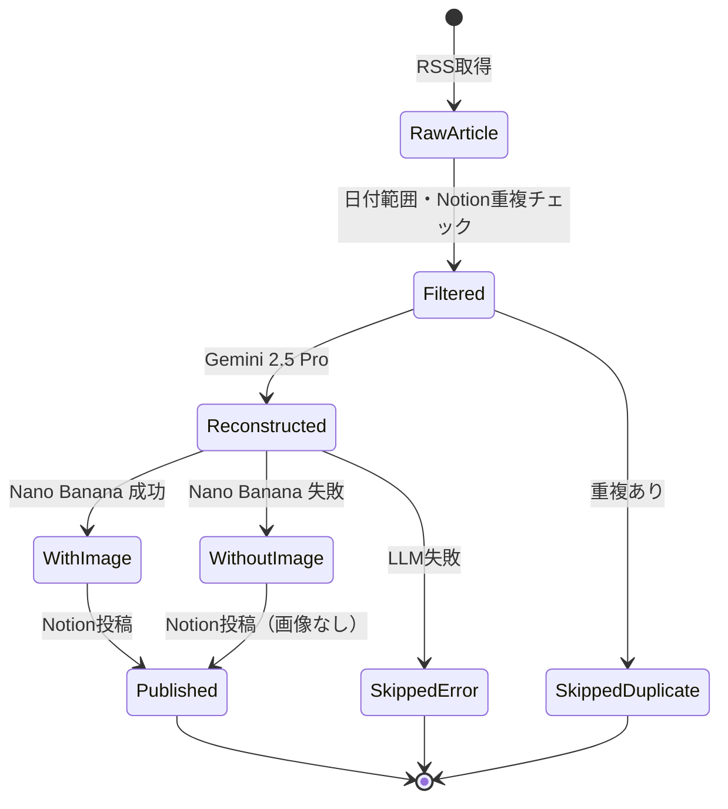
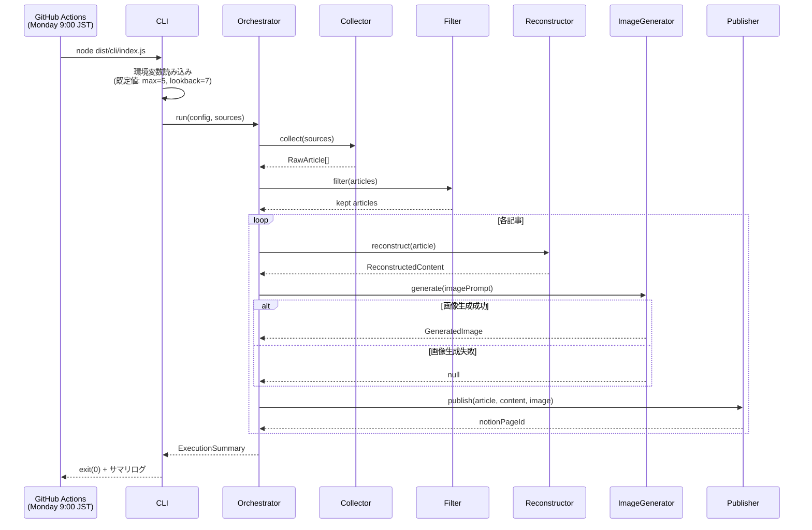
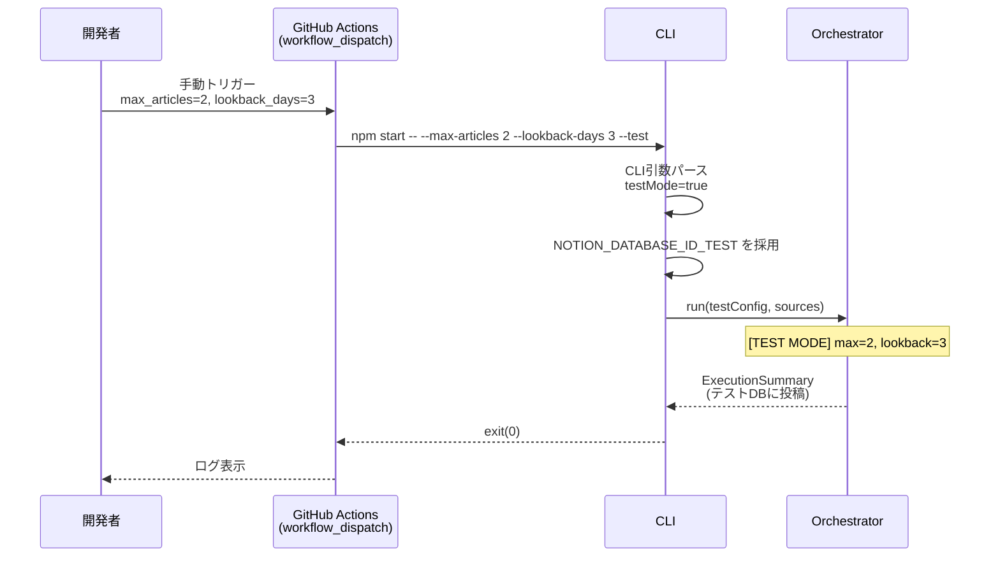

# 機能設計書 (Functional Design Document)

本書は `docs/product-requirements.md` で定義された要件を技術的に実現する方法を定義する。

---

## システム構成図

### 全体構成

```mermaid
graph TB
    Trigger[GitHub Actions<br/>週次スケジュール / 手動トリガー]
    CLI[CLI レイヤー<br/>src/cli]
    Orchestrator[Orchestrator<br/>実行の総合制御]

    subgraph Service[サービスレイヤー]
        Collector[ArticleCollector<br/>RSS収集]
        Filter[ArticleFilter<br/>期間・重複フィルタ]
        Reconstructor[ContentReconstructor<br/>LLM再構成]
        ImageGen[ImageGenerator<br/>画像生成]
        Publisher[NotionPublisher<br/>Notion投稿]
    end

    subgraph Infra[データ / 外部連携レイヤー]
        RSS[RssClient]
        Gemini[GeminiClient<br/>Gemini 2.5 Pro]
        NanoBanana[ImageGenClient<br/>Gemini 2.5 Flash Image]
        Notion[NotionClient<br/>@notionhq/client]
    end

    External1[AI企業 公式ブログ RSS]
    External2[Google Gemini API]
    External3[Notion Database]

    Trigger --> CLI
    CLI --> Orchestrator
    Orchestrator --> Collector
    Orchestrator --> Filter
    Orchestrator --> Reconstructor
    Orchestrator --> ImageGen
    Orchestrator --> Publisher

    Collector --> RSS
    Filter --> Notion
    Reconstructor --> Gemini
    ImageGen --> NanoBanana
    Publisher --> Notion

    RSS --> External1
    Gemini --> External2
    NanoBanana --> External2
    Notion --> External3
```

### 責務の分離方針

- **CLI レイヤー**: 引数・環境変数の解釈、パラメータ検証、Orchestrator の起動
- **Orchestrator**: 処理フローの制御、エラー伝搬方針の決定、ログ集計
- **サービスレイヤー**: 各ドメイン処理（収集／LLM再構成／画像生成／投稿）の実装
- **データ / 外部連携レイヤー**: 外部APIクライアントの薄いラッパー（タイムアウト・型変換のみ担当、リトライは Service 層で制御）

---

## 技術スタック

| 分類 | 技術 | 選定理由 |
|------|------|----------|
| 言語 | TypeScript 5.x | 型安全性、strict モードでの品質保証 |
| ランタイム | Node.js 24.x | devcontainer指定版、安定したESM対応 |
| 実行環境 | GitHub Actions | 週次Cronをコスト・運用ゼロで実現 |
| CLIフレームワーク | Commander.js | 軽量・学習コスト低 |
| RSS取得 | rss-parser | RSS/Atom両対応・シンプルAPI |
| LLM | Google Gemini 2.5 Pro | 読み物として自然な文体生成、長文コンテキスト |
| LLM SDK | @google/genai | 公式SDK、画像生成と同一API |
| 画像生成 | Gemini 2.5 Flash Image（Nano Banana） | Geminiスタックに統一、認証を一本化 |
| Notion連携 | @notionhq/client | 公式SDK、TypeScript型定義付き |
| ロギング | pino | 構造化ログ、GitHub Actions ログとの親和性 |
| テスト | Vitest | ESM/TS対応、プロジェクト既存設定済み |
| Lint/Format | ESLint 9 + Prettier | 既存設定 |

---

## データモデル定義

### エンティティ定義

```typescript
// src/domain/types.ts

/** RSSから取得した生記事 */
export interface RawArticle {
  sourceId: string;         // ソース識別子 (例: "openai", "anthropic", "google-deepmind")
  sourceName: string;       // 表示名 (例: "OpenAI", "Anthropic")
  title: string;            // 記事タイトル
  url: string;              // 一意なURL（重複判定のキー）
  publishedAt: Date;        // 公開日時
  rawContent: string;       // 本文またはサマリー（RSSに含まれる範囲）
}

/** LLMで再構成されたコンテンツ */
export interface ReconstructedContent {
  titleJa: string;          // 記事タイトルの日本語訳
  overview: string;         // ①概要（1〜2文）
  technicalImpact: string;  // ②技術的インパクト・注目ポイント
  context: string;          // ③関連する背景・文脈
  insights: string;         // ④所感・示唆
  imagePrompt: string;      // 画像生成用プロンプト（英語、100〜300語）
}

/** 生成された画像 */
export interface GeneratedImage {
  data: Buffer;             // 画像バイナリ
  mimeType: 'image/png' | 'image/jpeg';
  prompt: string;           // 生成時に使用したプロンプト
}

/** 実行パラメータ（テストモード含む） */
export interface ExecutionConfig {
  maxArticles: number;      // 各ソースあたりの最大記事数（既定: 5）
  lookbackDays: number;     // 遡る日数（既定: 7）
  testMode: boolean;        // テストモードフラグ
  notionDatabaseId: string; // 投稿先DB（本番 or テスト）
}

/** 1記事あたりの処理結果 */
export interface ArticleResult {
  article: RawArticle;
  status: 'published' | 'skipped_duplicate' | 'skipped_error';
  failureStage?: 'reconstruct' | 'image' | 'notion';
  errorMessage?: string;
  notionPageId?: string;
  hasImage: boolean;        // false の場合は画像生成に失敗しテキストのみ投稿
}

/** 実行全体のサマリ */
export interface ExecutionSummary {
  startedAt: Date;
  finishedAt: Date;
  testMode: boolean;
  sources: {
    sourceId: string;
    fetched: number;
    filtered: number;
  }[];
  results: ArticleResult[];
  counts: {
    published: number;
    skippedDuplicate: number;
    skippedError: number;
    withImage: number;
    withoutImage: number;
  };
}
```

### データの流れ（状態遷移）



### Notionデータベース・スキーマ

#### データベース命名規則

データベース名は **`YYYY-MM-DD-GenAI-Trend-News`**（実行日の日付）形式とする。
例: `2026-04-21-GenAI-Trend-News`

#### 自動生成の動作

| 起動時の状態 | 動作 |
|-------------|------|
| `NOTION_PARENT_PAGE_ID` 配下に "AI Trend Sync DB" が存在する | 既存 DB を再利用（冪等） |
| `NOTION_PARENT_PAGE_ID` 配下に "AI Trend Sync DB" が存在しない | 新規 DB を作成 |
| `NOTION_PARENT_PAGE_ID` が未設定 | 起動時に fatal エラーで終了 |

#### プロパティ定義

| プロパティ | 型 | 内容 |
|-----------|-----|------|
| Title | title | 記事タイトル（日本語訳） |
| Source | select | ソース企業名 (OpenAI / Anthropic / Google DeepMind) |
| URL | url | 元記事URL（重複判定キー） |
| Published At | date | 記事公開日 |
| Summary | rich_text | 記事概要（overview フィールド） |
| SyncedAt | date | 本システムで投稿した日時 |
| HasImage | checkbox | 画像添付の有無 |

ページ本文構成:
1. アイキャッチ画像（生成成功時のみ）
2. Heading 2 "概要" + overview
3. Heading 2 "技術的インパクト" + technicalImpact
4. Heading 2 "背景" + context
5. Heading 2 "所感・示唆" + insights
6. Divider + 元記事URL

---

## コンポーネント設計

### ConfigLoader

**責務**: 環境変数・CLI引数・設定ファイルから `ExecutionConfig` と RSSソース一覧を組み立てる。起動時に `NotionSetupService` を呼び出して `NOTION_PARENT_PAGE_ID` 配下の "AI Trend Sync DB" を検索・作成し DB ID を解決する

```typescript
interface RssSource {
  id: string;
  name: string;
  feedUrl: string;
}

class ConfigLoader {
  loadExecutionConfig(args: CliArgs, env: NodeJS.ProcessEnv): ExecutionConfig;
  loadSources(): RssSource[]; // config/sources.json 読み込み
  resolveNotionDatabaseId(env: NodeJS.ProcessEnv, notionClient: NotionClient): Promise<string>;
}
```

**DB ID 解決ロジック**:
1. `NOTION_PARENT_PAGE_ID`（テストモード時は `NOTION_PARENT_PAGE_ID_TEST` を優先）を使用
2. `NotionSetupService.findOrCreateDatabase(parentPageId)` を呼び出し、"AI Trend Sync DB" を検索または作成
3. `NOTION_PARENT_PAGE_ID` 未設定 → `ConfigError` で exit(1)

**依存**: ファイルシステム、環境変数、NotionSetupService

---

### NotionSetupService

**責務**: 初回実行時に Notion データベースを自動生成する。既存 DB が見つかれば再利用する（冪等）

```typescript
class NotionSetupService {
  constructor(private notionClient: NotionClient) {}

  findOrCreateDatabase(parentPageId: string, date: Date): Promise<string>; // databaseId を返す
}
```

**処理フロー**:
1. Notion `search` API で DB 名 `YYYY-MM-DD-GenAI-Trend-News` を検索（親ページ配下）
2. 一致する DB が見つかれば ID を返して終了
3. 見つからない場合: `databases.create` で DB を新規作成し、ID を info ログに出力して返す

**自動設定するプロパティスキーマ**:
```typescript
properties: {
  'Title':       { title: {} },
  'Source':      { select: { options: [
                    { name: 'OpenAI', color: 'green' },
                    { name: 'Anthropic', color: 'orange' },
                    { name: 'Google DeepMind', color: 'blue' },
                 ] } },
  'URL':         { url: {} },
  'PublishedAt': { date: {} },
  'SyncedAt':    { date: {} },
  'HasImage':    { checkbox: {} },
}
```

**失敗時の振る舞い**: DB 初期化は処理の前提条件のため、失敗時は `ConfigError` を throw し全体を停止する

**依存**: NotionClient

---

### ArticleCollector

**責務**: 各 RSSソースから記事を取得し `RawArticle[]` を返す。取得失敗ソースはスキップしエラーログを残す

```typescript
class ArticleCollector {
  constructor(private rssClient: RssClient) {}
  collect(sources: RssSource[]): Promise<RawArticle[]>;
}
```

**失敗時の振る舞い**: 個別ソースのエラーは warn ログを出して当該ソースのみスキップ、他ソースの処理を継続

---

### ArticleFilter

**責務**:
1. `lookbackDays` の範囲外の記事を除外
2. Notion上の既存記事とURL比較し重複記事を除外
3. ソースごとに `maxArticles` 件まで絞り込み

```typescript
class ArticleFilter {
  constructor(private notionClient: NotionClient, private config: ExecutionConfig) {}

  filter(articles: RawArticle[]): Promise<{
    kept: RawArticle[];
    droppedByDate: RawArticle[];
    droppedByDuplicate: RawArticle[];
  }>;
}
```

**重複判定ロジック**: 対象DBの `URL` プロパティと完全一致で判定（Notion API の `databases.query` を使用）

---

### ContentReconstructor

**責務**: `RawArticle` を Gemini 2.5 Pro に渡し、`ReconstructedContent` を返す

```typescript
class ContentReconstructor {
  constructor(private geminiClient: GeminiClient) {}
  reconstruct(article: RawArticle): Promise<ReconstructedContent>;
}
```

**プロンプト設計（概略）**:
- System: "あなたはAIトレンドを読者に伝えるテックライター。〜（スタイル・長さ・日本語指定）"
- User: 記事タイトル・公開日・ソース名・本文
- 出力: 構造化JSON (`{ titleJa, overview, technicalImpact, context, insights, imagePrompt }`) を Gemini の **Structured Output（responseSchema）** で強制する

**タイムアウト**: 30秒（非機能要件より）
**リトライ**: 一時的なAPIエラー（5xx / rate limit）のみ最大2回、指数バックオフ

---

### ImageGenerator

**責務**: 画像プロンプトを受け取り、Gemini 2.5 Flash Image で画像を生成する

```typescript
class ImageGenerator {
  constructor(private imageGenClient: ImageGenClient) {}
  generate(prompt: string): Promise<GeneratedImage | null>; // 失敗時は null
}
```

**失敗時の振る舞い**: `null` を返却し、Orchestrator は画像なしで Notion 投稿に進む（テキスト記事の投稿は止めない）

**タイムアウト**: 60秒

---

### NotionPublisher

**責務**: `RawArticle` + `ReconstructedContent` + `GeneratedImage | null` を受け取り、Notionに1ページ作成する

```typescript
class NotionPublisher {
  constructor(private notionClient: NotionClient, private config: ExecutionConfig) {}
  publish(
    article: RawArticle,
    content: ReconstructedContent,
    image: GeneratedImage | null
  ): Promise<string>; // notionPageId を返す
}
```

**画像の扱い**:
- MVPでは **Notion API が外部URLしか受け付けない制約** のため、生成画像を一時ホスト（例: GitHub Actions のアーティファクト経由 / Imgur API / Gyazo）にアップロードしてURLを得る設計
- 初期実装では **GitHub のリポジトリ内 `generated-images/` ブランチに push して raw URL を使う方式** を採用（外部サービス依存を避ける）
- 本方針はアーキテクチャ設計書で最終確定する

---

### Orchestrator

**責務**: 全体フローを制御し `ExecutionSummary` を返す

```typescript
class Orchestrator {
  async run(config: ExecutionConfig, sources: RssSource[]): Promise<ExecutionSummary>;
}
```

**処理順序**:
1. ArticleCollector で全ソースから並列収集
2. ArticleFilter で絞り込み
3. 記事ごとに **直列** で以下を実行（API レート制限回避）:
   a. ContentReconstructor
   b. ImageGenerator（失敗時は null で継続）
   c. NotionPublisher
4. 記事単位の失敗は `ArticleResult.status = 'skipped_error'` として記録し次の記事へ
5. 最終的に `ExecutionSummary` を出力

---

## ユースケース

### UC-1: 週次の自動実行（本番運用）



### UC-2: テストモードでの手動実行



---

## CLIインターフェース仕様

```bash
# 本番運用（GitHub Actions Cron）
node dist/cli/index.js

# 手動・テスト実行
node dist/cli/index.js --max-articles 2 --lookback-days 3 --test
npm start -- --max-articles 2 --lookback-days 3 --test
```

| オプション | 環境変数 | 既定値 | 説明 |
|-----------|---------|-------|------|
| `--max-articles <n>` | `MAX_ARTICLES` | 5 | 各ソースあたりの最大記事数 |
| `--lookback-days <n>` | `LOOKBACK_DAYS` | 7 | 収集対象とする遡り日数 |
| `--test` | `TEST_MODE=true` | false | テストモード（テストDBへ投稿） |

**環境変数一覧**:

| 環境変数 | 必須 | 説明 |
|---------|------|------|
| `GEMINI_API_KEY` | 必須 | Gemini API キー |
| `NOTION_API_KEY` | 必須 | Notion Integration トークン |
| `NOTION_PARENT_PAGE_ID` | 必須 | "AI Trend Sync DB" を自動生成・再利用する親ページ ID |
| `NOTION_PARENT_PAGE_ID_TEST` | テストモード時にオプション | テストモード時の親ページ ID（未設定時は `NOTION_PARENT_PAGE_ID` を使用） |
| `GITHUB_TOKEN` | 必須（GitHub Actions 自動注入） | 画像を `generated-images` ブランチへアップロードするためのトークン |
| `GITHUB_REPOSITORY` | 必須 | `owner/repo` 形式。画像 URL 生成に使用 |

---

## ファイル構造（設計時点）

```
src/
├── cli/
│   └── index.ts              # エントリーポイント、引数パース
├── orchestrator/
│   └── orchestrator.ts
├── services/
│   ├── article-collector.ts
│   ├── article-filter.ts
│   ├── content-reconstructor.ts
│   ├── image-generator.ts
│   ├── notion-publisher.ts
│   └── notion-setup.ts           # Notion DB 自動生成・再利用
├── infra/
│   ├── rss-client.ts
│   ├── gemini-client.ts
│   ├── image-gen-client.ts
│   ├── image-host-client.ts
│   └── notion-client.ts
├── config/
│   ├── config-loader.ts
│   └── env-schema.ts
├── domain/
│   └── types.ts              # 全データモデル
└── utils/
    └── logger.ts             # pino

config/
└── sources.json              # RSSソース定義

tests/
├── unit/
├── integration/
└── fixtures/

.github/workflows/
└── weekly-sync.yml
```

`config/sources.json` の例:
```json
{
  "sources": [
    { "id": "openai", "name": "OpenAI", "feedUrl": "https://openai.com/blog/rss.xml" },
    { "id": "anthropic", "name": "Anthropic", "feedUrl": "https://www.anthropic.com/news/rss.xml" },
    { "id": "google-deepmind", "name": "Google DeepMind", "feedUrl": "https://deepmind.google/blog/rss.xml" }
  ]
}
```

※ 実際のフィードURLはアーキテクチャ設計フェーズで最終確認する

---

## パフォーマンス最適化

- **ソース収集の並列化**: `Promise.all` で RSS取得を並列実行（3〜10ソース想定）
- **記事処理は直列**: LLM/画像APIのレート制限回避のため、記事単位は直列に処理
- **Notion重複チェックの最適化**: 実行開始時に対象DBの URL一覧を1回だけ取得してメモリ上で照合（記事ごとにクエリしない）
- **画像のストリーム処理**: 生成画像はメモリ上で扱い、ディスクI/Oを最小化

---

## セキュリティ考慮事項

| 考慮事項 | 対策 |
|---------|------|
| APIキーの漏洩 | GitHub Secrets で管理、ログ出力時にマスク |
| 生成画像の個人情報混入 | モデル側のセーフティフィルタに依存 + プロンプトで明示的に「実在人物の生成禁止」を指示 |
| 依存パッケージの脆弱性 | CI で `npm audit --audit-level=high` を実行 |
| 一時画像ホストの公開範囲 | 投稿URLはNotion内部のみ参照される想定だが、リポジトリアクセス可能な人は閲覧可能。機密情報を画像に含めない |

---

## エラーハンドリング

| エラー種別 | 発生箇所 | 処理 | ログレベル |
|-----------|---------|------|-----------|
| RSS取得失敗 | ArticleCollector | 当該ソースをスキップし他ソース継続 | warn |
| LLM API タイムアウト | ContentReconstructor | 指数バックオフで2回まで再試行、それでも失敗なら当該記事スキップ | error |
| LLM レスポンス形式不正 | ContentReconstructor | 当該記事スキップ | error |
| 画像生成失敗・セーフティブロック | ImageGenerator | `null` を返し、Orchestratorは画像なしで投稿継続 | warn |
| Notion API 認証エラー | NotionPublisher | 全体処理を中断（設定ミスのため継続不能） | fatal |
| Notion 投稿失敗（個別） | NotionPublisher | 当該記事を `skipped_error` にして継続 | error |
| 必須環境変数欠落（両方未設定） | ConfigLoader | 起動時に即座にエラーで終了 | fatal |
| Notion DB 検索失敗 | NotionSetupService | ConfigError を throw → 全体停止（DB 初期化は前提条件） | fatal |
| Notion DB 作成失敗 | NotionSetupService | ConfigError を throw → 全体停止 | fatal |
| 親ページが見つからない（403/404） | NotionSetupService | ConfigError を throw → 全体停止 | fatal |

**Orchestrator の終了コード**:
- `0`: 正常終了（記事0件でも成功扱い）
- `1`: 設定不備・致命的エラー（Notion認証失敗など）

---

## テスト戦略

### ユニットテスト（Vitest）

| 対象 | 主要ケース |
|------|-----------|
| ArticleFilter | 日付範囲フィルタ、重複除外、maxArticles制限 |
| ContentReconstructor | Gemini クライアントをモックし、プロンプト組立て・レスポンス解釈を検証 |
| ImageGenerator | API失敗時に null を返すことを確認 |
| NotionPublisher | ブロック構築ロジック、画像なし時の分岐 |
| ConfigLoader | 環境変数・引数の優先順位、既定値、必須値欠落時のエラー |

### 統合テスト

| シナリオ | 内容 |
|---------|------|
| RSS→Orchestrator | 固定RSSフィクスチャ、Gemini/Notionはモックして全体フロー |
| テストモード | `--test` フラグ時にテストDBに書き込まれること |
| 部分失敗 | 3記事のうち1記事でLLM失敗、他2記事は投稿されること |

### E2E（手動・限定実行）

- GitHub Actions で `workflow_dispatch` により `--test --max-articles 1 --lookback-days 1` を実行し、テスト用Notion DB に記事が投稿されることを確認する

### カバレッジ目標

- 行カバレッジ 80% 以上（`vitest run --coverage`）
- 外部API呼び出し部分（Infraレイヤー）はモック/スタブで再現
