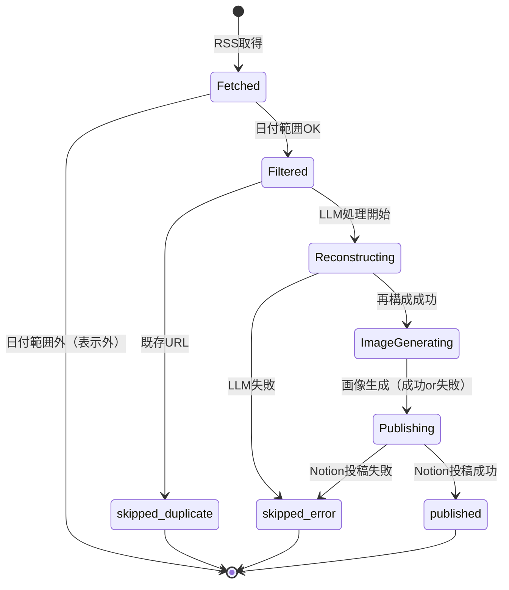

# プロジェクト用語集 (Glossary)

本書は `genai-trend-sync` で使用される用語を統一的に定義する。各ドキュメント（PRD / 機能設計 / アーキテクチャ / リポジトリ構造 / 開発ガイドライン）で同一概念を表す語を揃えるための真実源。

**更新日**: 2026-04-18

---

## ドメイン用語

プロジェクト固有のビジネス・機能上の概念。

### 記事（Article）
**定義**: AI企業の公式情報ソースから取得した個々のコンテンツ単位。

**説明**: 本システムで扱う最小の処理単位。RSSフィードの1エントリに対応し、処理過程で `RawArticle` → `ReconstructedContent` → Notion ページへと形を変える。

**関連用語**: RawArticle / ReconstructedContent / ソース

---

### ソース（Source）
**定義**: 記事を取得する対象となるAI企業のRSSフィード。

**説明**: `config/sources.json` で定義される。MVP時点では OpenAI / Anthropic / Google DeepMind の3ソース。各ソースは `sourceId`（一意識別子）と表示名 `sourceName` を持つ。

**使用例**:
- `sources.json` に1エントリ追加することで新規ソースを追加できる
- Notion DB の `Source` プロパティの select 値として現れる

**英語表記**: Source

---

### 再構成（Reconstruction）
**定義**: LLM によって記事原文を、読みやすく・記憶に残る読み物形式に書き直す処理。

**説明**: 本プロダクトのコア価値。単なる要約（summarization）ではなく、**①概要 / ②技術的インパクト / ③背景・文脈 / ④所感・示唆** の4セクションで構成された読み物を生成する。実装は `ContentReconstructor` が担当。

**関連用語**: ReconstructedContent / 画像プロンプト

**英語表記**: Reconstruction（※ "Summarization" とは区別する）

---

### 画像プロンプト（Image Prompt）
**定義**: 記事のコア概念を視覚化するために、LLMが同時に生成する英語の画像生成用指示文。

**説明**: 長さ100〜300語程度、英語。`ContentReconstructor` の出力 `ReconstructedContent.imagePrompt` に格納され、`ImageGenerator` に渡されて画像が生成される。

**関連用語**: Nano Banana / ImageGenerator

---

### テストモード（Test Mode）
**定義**: 本番運用と同じロジックを、処理件数・期間を絞って実行する開発・検証用モード。

**説明**: `--test` フラグまたは `TEST_MODE=true` 環境変数で有効化。`NOTION_DATABASE_ID_TEST` を投稿先として使用し、本番DBを汚染せずにプロンプト等の調整が可能。ログに `[TEST MODE]` の識別子が出力される。

**使用例**:
```bash
node dist/cli/index.js --test --max-articles 2 --lookback-days 3
```

**関連用語**: ExecutionConfig / workflow_dispatch

---

### 冪等性（Idempotency）
**定義**: 同じ入力で処理を複数回実行しても、最終状態が変わらない性質。

**説明**: 本システムでは「同一URLの記事は2度Notion投稿されない」ことで実現する。`ArticleFilter` が実行開始時に Notion 上の既存URLを取得し、重複記事を除外する。週次実行が誤って複数回走っても安全。

**関連用語**: ArticleFilter / 重複判定

**英語表記**: Idempotency

---

### 週次実行（Weekly Sync）
**定義**: GitHub Actions の Cron スケジュールで毎週月曜 JST 9:00 に自動起動される本番実行。

**説明**: 本プロダクトの標準的な運用形態。`.github/workflows/weekly-sync.yml` で定義。`workflow_dispatch` による手動トリガーも可能。

**関連用語**: workflow_dispatch / テストモード

---

## 技術用語

### Gemini 2.5 Pro
**定義**: Google が提供する推論能力の高い LLM モデル。

**公式**: https://ai.google.dev/

**本プロジェクトでの用途**: 記事の再構成と画像プロンプトの生成を担当。`ContentReconstructor` から `@google/genai` SDK 経由で呼び出す。

**環境変数**: `GEMINI_TEXT_MODEL`（既定 `gemini-2.5-pro`）

---

### Gemini 2.5 Flash Image（Nano Banana）
**定義**: Google が提供する画像生成・編集モデル。「Nano Banana」は同モデルの通称。

**公式**: https://ai.google.dev/

**本プロジェクトでの用途**: 記事ごとのアイキャッチ／概念図を生成。`ImageGenerator` から `@google/genai` SDK 経由で呼び出す。

**環境変数**: `GEMINI_IMAGE_MODEL`（既定 `gemini-2.5-flash-image`）

---

### Notion API
**定義**: Notion が提供するワークスペース操作用の公式 REST API。

**公式**: https://developers.notion.com/

**本プロジェクトでの用途**: 再構成された記事をデータベースにページとして投稿する。`@notionhq/client` を利用。

**関連**: NOTION_API_KEY / NOTION_DATABASE_ID / NOTION_DATABASE_ID_TEST

---

### GitHub Contents API
**定義**: GitHub が提供する、リポジトリ内ファイルを直接読み書きする REST API。

**本プロジェクトでの用途**: 生成画像を `generated-images` ブランチに push するために使用。`@octokit/rest` 経由で `repos.createOrUpdateFileContents` を呼ぶ。

**関連用語**: generated-images ブランチ / raw.githubusercontent.com

---

### GitHub Actions
**定義**: GitHub に組み込まれた CI/CD・ワークフロー実行基盤。

**本プロジェクトでの用途**: 週次バッチ実行と手動テスト実行の両方を担う。本プロダクトの実行基盤そのもの。

**関連用語**: workflow_dispatch / cron

---

### workflow_dispatch
**定義**: GitHub Actions ワークフローを GUI または API から手動起動するトリガー。

**本プロジェクトでの用途**: テストモード実行や緊急時の再実行に利用。`max_articles` / `lookback_days` / `test_mode` を入力値として受け取る。

---

### rss-parser
**定義**: RSS / Atom フィードをパースする Node.js ライブラリ。

**本プロジェクトでの用途**: `RssClient` の内部実装として利用。各AI企業のブログフィードを取得・パースする。

---

### pino
**定義**: Node.js 向けの高速な構造化ロギングライブラリ。

**本プロジェクトでの用途**: 全ログ出力の基盤。NDJSON 形式で出力し、GitHub Actions ログと親和性が高い。

**使用ルール**: `console.log` は禁止、必ず pino 経由（開発ガイドライン参照）

---

### zod
**定義**: TypeScript 向けのランタイム型検証ライブラリ。

**本プロジェクトでの用途**: 環境変数・設定ファイル・LLM レスポンスの検証。境界層で不正値を早期に検出する。

---

### Vitest
**定義**: Vite ベースの高速なテストランナー。ESM / TypeScript にネイティブ対応。

**本プロジェクトでの用途**: ユニット・統合テスト共通のフレームワーク。`vitest.config.ts` で設定。

---

### Dev Container
**定義**: VS Code が提供する、Docker ベースの開発環境定義機能。

**本プロジェクトでの用途**: Node.js 24 + 必要ツールを含むコンテナを `.devcontainer/devcontainer.json` で定義。開発者のローカル環境差を排除する。

---

## 略語・頭字語

### PRD
**正式名称**: Product Requirements Document

**意味**: プロダクト要求定義書。何を作るかを定義する文書。

**本プロジェクトでの使用**: `docs/product-requirements.md`

---

### MVP
**正式名称**: Minimum Viable Product

**意味**: 最小限の価値を提供する製品。P0 機能のみを含む初期リリース。

---

### PoC
**正式名称**: Proof of Concept

**意味**: 概念実証。本プロジェクトは個人利用 + 社内共有のための PoC と位置付けられる。

---

### LLM
**正式名称**: Large Language Model

**意味**: 大規模言語モデル。本プロジェクトでは Gemini 2.5 Pro を指す。

---

### RSS
**正式名称**: Really Simple Syndication

**意味**: Webサイトの更新情報を配信するための XML ベースフォーマット。

**本プロジェクトでの使用**: AI企業の公式ブログから記事を収集する一次ソース。

---

### API
**正式名称**: Application Programming Interface

**意味**: ソフトウェア同士が通信するためのインターフェース。

**本プロジェクトでの使用**: Gemini / Notion / GitHub の REST API を指すことが多い。

---

### KPI
**正式名称**: Key Performance Indicator

**意味**: 重要業績評価指標。`docs/product-requirements.md` の「成功指標」で定義。

---

### CI / CD
**正式名称**: Continuous Integration / Continuous Delivery

**意味**: 継続的インテグレーション / 継続的デリバリー。

**本プロジェクトでの使用**: GitHub Actions を用いて実装（CI は Post-MVP で追加予定）。

---

### ADR
**正式名称**: Architecture Decision Record

**意味**: アーキテクチャ判断記録。主要な技術選定の意思決定を記録する短い文書。

**本プロジェクトでの使用**: `docs/architecture.md` 末尾に4件の要約形式で記載（ADR-1〜ADR-4）。

---

### ESM
**正式名称**: ECMAScript Modules

**意味**: JavaScript 標準のモジュール仕様。`import` / `export` 構文を使う。

**本プロジェクトでの使用**: `package.json` の `"type": "module"` で有効化。相対インポートは `.js` 拡張子付き必須。

---

### JST / UTC
**意味**: JST = 日本標準時（UTC+9）。UTC = 協定世界時。

**本プロジェクトでの使用**: Cron は UTC で定義されるため「JST月曜9:00 = UTC月曜0:00」と変換して記述する。

---

## アーキテクチャ用語

### 4レイヤーアーキテクチャ
**定義**: CLI → Orchestrator → Services → Infra の4層からなるレイヤード構造。

**本プロジェクトでの適用**: `src/` 配下のディレクトリがそのまま層に対応。`domain` / `config` / `utils` は全層から参照可能な支援モジュール。

**依存方向**:
```
cli  →  orchestrator  →  services  →  infra
                                         ↓
                              外部API / 外部サービス

全層 → domain / utils（参照のみ）
```

**関連ドキュメント**: `docs/repository-structure.md` の「依存関係のルール」

---

### Orchestrator
**定義**: 収集→フィルタ→再構成→画像生成→投稿の一連フローを制御する総合コーディネーター。

**本プロジェクトでの適用**: `src/orchestrator/orchestrator.ts` に単一クラスとして実装。

**責務**:
- 処理順序の決定（並列 / 直列）
- 記事単位のエラー封じ込め
- `ExecutionSummary` の集計と返却

---

### Infra レイヤー
**定義**: 外部API・外部サービスへのアクセスを隠蔽する薄いラッパー群。

**本プロジェクトでの適用**: `src/infra/` 配下に配置。RssClient / GeminiClient / ImageGenClient / NotionClient / ImageHostClient の5クライアント。

**禁止事項**: ビジネスロジックを持たない（タイムアウト・型変換のみ担う）

---

### 孤立ブランチ（Orphan Branch）
**定義**: 他のどのブランチとも履歴を共有しない、独立した Git ブランチ。

**本プロジェクトでの適用**: `generated-images` ブランチを `main` と切り離して運用。生成画像のホスト専用。

**関連用語**: generated-images ブランチ / GitHub Contents API

---

### 部分失敗耐性
**定義**: 一部の処理単位で失敗が起きても、他の単位の処理を止めずに全体を完走させる設計方針。

**本プロジェクトでの適用**:
- 1ソースの取得失敗 → 他ソースを継続
- 1記事の LLM 失敗 → 他記事を継続
- 1記事の画像生成失敗 → テキストのみで投稿継続

**関連用語**: ArticleResult / skipped_error

---

### Structured Output（構造化出力）
**定義**: LLM API に JSON スキーマを渡し、レスポンスを指定構造に強制する機能。

**本プロジェクトでの適用**: Gemini 2.5 Pro の `responseSchema` を使い、`ReconstructedContent` の形で確実に受け取る。パース失敗のリスクを最小化する。

---

## ステータス・状態

### 記事処理ステータス（ArticleResult.status）

`Orchestrator` が各記事ごとに付与する最終ステータス。

| ステータス値 | 意味 | 発生条件 |
|------------|------|---------|
| `published` | Notion 投稿成功 | 全ステージが成功（画像なしでも成功扱い） |
| `skipped_duplicate` | 重複のためスキップ | 同一URLが Notion に既存 |
| `skipped_error` | エラーによりスキップ | LLM失敗 / Notion投稿失敗等、リトライ不可 |

**状態遷移図**:


---

### 画像生成ステータス（ArticleResult.hasImage）

| 値 | 意味 |
|----|------|
| `true` | Notion ページにアイキャッチ画像が添付されている |
| `false` | 画像生成に失敗、テキストのみで投稿された |

---

## データモデル用語

### RawArticle
**定義**: RSSから取得した加工前の記事データ。

**主要フィールド**:
- `sourceId`: ソース識別子（例: `"openai"`）
- `sourceName`: 表示用名称（例: `"OpenAI"`）
- `title`: 記事タイトル
- `url`: 一意なURL（**重複判定のキー**）
- `publishedAt`: 公開日時
- `rawContent`: 本文またはサマリー

**定義箇所**: `src/domain/types.ts`

---

### ReconstructedContent
**定義**: LLM によって再構成された記事コンテンツ。

**主要フィールド**:
- `overview`: ①概要（1〜2文）
- `technicalImpact`: ②技術的インパクト
- `context`: ③背景・文脈
- `insights`: ④所感・示唆
- `imagePrompt`: 画像生成用プロンプト（英語）

**関連**: ContentReconstructor / Structured Output

---

### GeneratedImage
**定義**: 画像生成APIによって生成された画像データ。

**主要フィールド**:
- `data`: 画像バイナリ（Buffer）
- `mimeType`: `'image/png'` または `'image/jpeg'`
- `prompt`: 生成に使用したプロンプト

---

### ExecutionConfig
**定義**: 1回の実行で使用するパラメータの集合。

**主要フィールド**:
- `maxArticles`: 各ソースあたり最大記事数（既定 5）
- `lookbackDays`: 遡る日数（既定 7）
- `testMode`: テストモードフラグ
- `notionDatabaseId`: 投稿先DB（本番 or テスト）

**関連**: ConfigLoader / テストモード

---

### ArticleResult
**定義**: 1記事の処理結果を表すオブジェクト。

**主要フィールド**:
- `article`: 元の `RawArticle`
- `status`: `published` / `skipped_duplicate` / `skipped_error`
- `failureStage`: 失敗時の段階（`reconstruct` / `image` / `notion`）
- `notionPageId`: 投稿成功時のページID
- `hasImage`: 画像添付有無

---

### ExecutionSummary
**定義**: 実行全体の集計情報。

**主要フィールド**:
- `startedAt` / `finishedAt`
- `testMode`
- `sources[]`: ソース別の取得件数・フィルタ件数
- `results[]`: 全 `ArticleResult`
- `counts`: 集計値（published / skipped_* / withImage / withoutImage）

**出力先**: CLI 終了時の stdout、および `$GITHUB_STEP_SUMMARY`

---

### RssSource
**定義**: `config/sources.json` で定義される個々のRSSフィード情報。

**主要フィールド**:
- `id`: 一意識別子（例: `"anthropic"`）
- `name`: 表示名
- `feedUrl`: RSS エンドポイントURL

---

## エラー・例外

本プロジェクトのカスタムエラー階層。全て `AppError` を基底クラスとする。定義箇所: `src/domain/errors.ts`

### AppError
**クラス名**: `AppError`

**発生条件**: 基底クラス。直接 throw せず、派生クラスを使う

**例**:
```typescript
class AppError extends Error {
  constructor(message: string, public readonly cause?: unknown) {
    super(message);
    this.name = this.constructor.name;
  }
}
```

---

### ConfigError
**クラス名**: `ConfigError`

**発生条件**: 必須環境変数の欠落、`sources.json` のスキーマ違反、型変換失敗

**対処方法**: **プロセスを即終了（exit 1）**。実行を続けても意味がないため、Orchestrator には伝播させない

---

### InfraError
**クラス名**: `InfraError`

**発生条件**: Infra レイヤーの外部API呼び出しで発生した一般的なエラーのラッパー

**対処方法**: Service 層でリトライまたはドメイン固有エラーへ再ラップ

---

### ReconstructError
**クラス名**: `ReconstructError`

**発生条件**: LLM API タイムアウト、レスポンス形式不正（zod 検証失敗）、リトライ上限到達

**対処方法**: 当該記事をスキップ（`skipped_error`）、次の記事へ進む

---

### ImageGenError
**クラス名**: `ImageGenError`

**発生条件**: 画像生成 API の失敗、セーフティブロック、タイムアウト

**対処方法**: **throw せず `null` を返す**。Orchestrator は画像なしでテキスト投稿を継続（部分失敗耐性）

---

### NotionPublishError
**クラス名**: `NotionPublishError`

**発生条件**: Notion API の投稿失敗。**認証エラー以外** は記事単位のスキップで継続

**対処方法**:
- 認証エラー（401/403）→ `ConfigError` に変換して全体停止
- その他（429 レート制限、500 等）→ 当該記事のみ `skipped_error`

---

## 計算・判定ロジック

### 記事の収集対象判定（lookbackDays）

**定義**: 現在時刻から `lookbackDays` 日前以降に公開された記事のみを対象とする。

**計算式**:
```
記事を対象とする条件:
  article.publishedAt >= (now - lookbackDays * 24h)
```

**実装箇所**: `src/services/article-filter.ts` / `src/utils/date.ts`

**例**:
```
現在時刻: 2026-04-20 09:00 JST
lookbackDays: 7
対象範囲: 2026-04-13 09:00 JST 以降
```

---

### 記事の重複判定

**定義**: Notion DB の `URL` プロパティと完全一致する記事は、重複とみなしてスキップする。

**ロジック**:
1. 実行開始時に Notion DB をクエリし、既存 URL 集合（`Set<string>`）をメモリ上に取得
2. 各 `RawArticle.url` を集合で照合
3. 含まれていれば `skipped_duplicate` として除外

**実装箇所**: `src/services/article-filter.ts`

**最適化**: Notion へのクエリは実行開始時の1回のみ（記事ごとに問い合わせない）

---

### 記事の件数制限（maxArticles）

**定義**: 各ソースについて `maxArticles` 件を上限とし、公開日降順で新しい記事を優先する。

**ロジック**:
```typescript
// 擬似コード
groupBySource(articles)
  .mapValues(list => list.sort(byPublishedDesc).slice(0, maxArticles))
  .flatten()
```

**実装箇所**: `src/services/article-filter.ts`

---

## 用語使用のガイドライン

### 揺れを避ける用語ペア

| 採用 | 避ける | 理由 |
|------|--------|------|
| 再構成（Reconstruction） | 要約（Summary） | 単なる要約ではない差別化を明確化するため |
| ソース（Source） | フィード / サイト | `sources.json` の命名と統一 |
| 記事（Article） | エントリ / 投稿 | ドメイン共通語として統一 |
| 投稿（Publish） | アップロード / 送信 | Notion への書き出しを指す動詞として統一 |
| スキップ（Skip） | 無視 / エラー扱い | `skipped_*` ステータスと整合 |
| 冪等性（Idempotency） | 重複防止 / 一意性 | 設計方針の正式名称として統一 |

### 表記揺れ対策

- **AI企業名**: 公式表記（OpenAI、Anthropic、Google DeepMind）を採用。日本語略称は使わない
- **Gemini / Nano Banana**: Gemini は製品名、Nano Banana は `gemini-2.5-flash-image` の通称として明記して併用可
- **Notion**: サービス名として固有名詞扱い（「ノーション」とはカタカナ表記しない）
